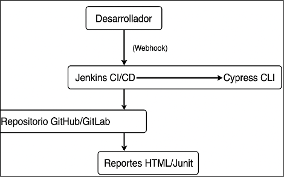

# 🌦️ Plan de Pruebas - Current Weather Data API (OpenWeatherMap)

**MEDELLÍN | COLOMBIA**  
**Elaborado por:** Mario Alejandro Benítez Orozco  
**2025**

---

## 📑 Tabla de Contenido

1. [Introducción](#1-introducción)
2. [Objetivo](#2-objetivo)
3. [Justificación](#3-justificacion)
4. [Alcance](#4-alcance)
5. [Estrategia de Pruebas](#5-estrategia-de-pruebas)
6. [Herramientas](#herramientas)
7. [Tipos de Validaciones/Aserciones](#tipos-de-validacionesaserciones)
8. [Criterios de Aceptación](#criterios-de-aceptación)
9. [Riesgos y Consideraciones](#riesgos-y-consideraciones)
10. [Integración CI/CD Recomendada](#integración-cicd-recomendada)
11. [Escenarios de Prueba Detallados](#escenarios-de-prueba-detallados)
12. [Conclusiones](#conclusiones)

---

## 1. Introducción

Este documento presenta el plan de pruebas para el endpoint **Current Weather Data API** de OpenWeatherMap. El propósito es asegurar la calidad, funcionalidad, robustez y precisión de la API frente a diversos escenarios de consulta. También se propone una solución integral y automatizada para validar la integración con este servicio externo.

---

## 2. Objetivo

Validar el comportamiento y la respuesta del endpoint `/weather` para solicitudes tanto válidas como inválidas, garantizando la entrega de información confiable y el manejo adecuado de errores.

---

## 3. Justificación

La correcta validación de servicios externos como OpenWeatherMap es crucial para sistemas que dependen de información meteorológica en tiempo real. Un plan de pruebas sólido asegura que cualquier integración será resiliente a cambios, errores y condiciones inesperadas, minimizando el riesgo de fallos en producción.

---

## 4. Alcance

- **Endpoint:** `GET /weather`
- **Entradas:** ciudad, coordenadas, código postal, API Key, unidades, idioma.
- **Cobertura:** respuestas exitosas, manejo de errores, validación de datos y tiempos de respuesta.

---

## 5. Estrategia de Pruebas

Se automatizarán todos los escenarios con **Cypress**, abarcando happy paths y edge cases, con ejecución local y en CI/CD.

---

## 6. Herramientas

- **Cypress** (automatización principal)
- **Postman** (manual/exploratorio, opcional)
- **GitHub Actions / Jenkins** (CI/CD)
- **Docker** (entorno controlado)

---

## 7. Tipos de Validaciones/Aserciones

- **Códigos HTTP:** 200, 400, 401, 404
- **Validación de esquema JSON**
- **Precisión de datos meteorológicos**
- **Manejo de errores y mensajes claros**
- **Headers correctos (Content-Type)**

---

## 8. Criterios de Aceptación

El endpoint debe responder correctamente a entradas válidas y manejar adecuadamente los errores, con datos meteorológicos completos y exactos según la documentación oficial.

---

## 9. Riesgos y Consideraciones

- Cambios inesperados en la API externa
- Límites de uso por API Key
- Diferencias regionales de datos meteorológicos

---

## 10. Integración CI/CD Recomendada – Arquitectura & Costo Cero

Se recomienda integrar **Cypress** en un pipeline CI/CD gratuito usando Jenkins y Docker.  
La arquitectura contempla triggers automáticos al realizar un push o pull request, construcción de imágenes, ejecución de pruebas y generación de reportes, con notificación al equipo.

>  <!-- Aquí puedes agregar una imagen de arquitectura si la tienes -->

---

## 11. Escenarios de Prueba Detallados

| #  | Escenario                              | Entrada de ejemplo                | Resultado esperado                          |
|----|----------------------------------------|-----------------------------------|---------------------------------------------|
| 1  | Consulta por ciudad válida             | `q=London`                        | 200 OK, datos meteorológicos correctos      |
| 2  | Consulta por coordenadas válidas       | `lat=40.71&lon=-74.01`            | 200 OK, datos correspondientes              |
| 3  | Consulta por código postal válido      | `zip=94040,us`                    | 200 OK, datos correctos                     |
| 4  | Consulta en diferentes unidades        | `units=imperial/units=metric`     | 200 OK, datos en unidad solicitada          |
| 5  | Consulta en idioma diferente           | `lang=es`                         | 200 OK, respuesta en español                |
| 6  | Ciudad inexistente                     | `q=NoExisteCiudad`                | 404 Not Found, mensaje de error             |
| 7  | Coordenadas fuera de rango             | `lat=999&lon=999`                 | 400 Bad Request o error adecuado            |
| 8  | API Key inválida o ausente             | Sin `appid` o valor incorrecto    | 401 Unauthorized, error de autenticación    |
| 9  | Falta de parámetros obligatorios       | Solo `appid`                      | 400 Bad Request, error descriptivo          |
| 10 | Formato incorrecto en parámetros       | `q=12345!@#`                      | 400 Bad Request o error adecuado            |
| 11 | Nombre de ciudad extremadamente largo  | `q=xxxxxxxxxxxxxxxxxx...`         | 400/404, manejo correcto de error           |
| 12 | Verificación de headers de respuesta   | Cualquier consulta                | Header Content-Type: application/json       |

---

## 12. Conclusiones

El plan propuesto cubre de manera integral la funcionalidad y resiliencia del endpoint de clima actual.  
La automatización con Cypress, combinada con una integración CI/CD de costo cero, garantiza calidad continua y feedback rápido para cualquier equipo de desarrollo.

---